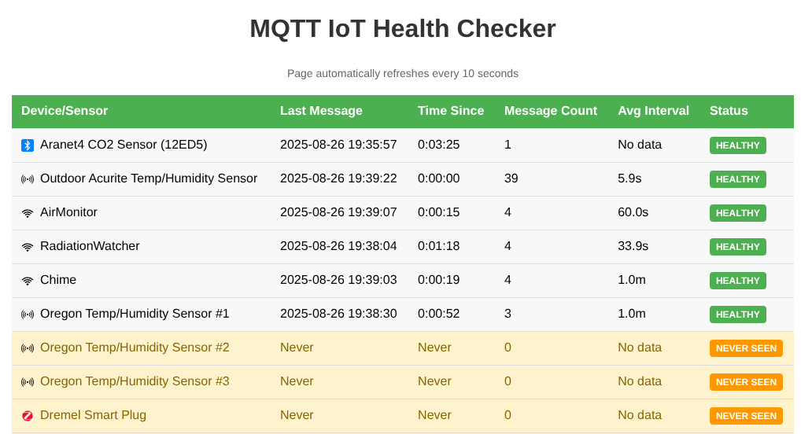

# MQTT IoT Health Checker

A Python application that monitors MQTT topics and displays their health status via a web interface.
Health is defined as having received _any_ message on the specified topic over the last 1 hour. 

Useful if you have a lot of IoT devices that publish their updates via MQTT and you want a quick way see if any device has gone offline. 

## Features

- Subscribes to multiple MQTT topics from a configurable list
- Tracks timestamps of last received messages for each topic
- Web interface displays topics in a table with color-coded status:
  - **Green**: Messages received within the last hour (healthy)
  - **Red**: Messages older than 1 hour (unhealthy)  
  - **Yellow**: Topics that have never received messages
- Auto-refreshes every 10 seconds
- REST API endpoint for status data



## Installation

1. Install dependencies:
```bash
pip install -r requirements.txt
```

2. Configure your MQTT topics in `topics.json`:
```json
{
  "topics": [
    {
      "topic": "homeassistant/sensor/Acurite-Tower-2782/state",
      "description": "Outdoor Acurite Temp/Humidity Sensor",
      "type": "433"
    },
    {
      "topic": "homeassistant/sensor/featherm0/state",
      "description": "AirMonitor",
      "type": "wifi"
    },
  ]
}
```
```
where "type": 
  "wifi" - IoT device that uses 802.11 wireless networking
  "eth" - IoT device directly wired via ethernet
  "zig" - IoT device that connects via Zigbee
  "433" - IoT device that uses 433MHz (ISM) radio
  "zwa" - IoT device that uses Z-Wave
  "bt" - IoT device that connects via Bluetooth
```

## Usage

Run the application:
```bash
python mqtt_healthcheck.py --host <IP> --port <1883> --user <mqtt-user> --password <password> --topics-file <topics.json>
```

Open your web browser and navigate to: http://localhost:5000

## API Endpoints

- `GET /` - Web interface
- `GET /api/status` - JSON status data for all topics
- `GET /metrics` - Prometheus exhibition format metrics

### Metrics

The /metrics endpoint returns Prometheus metrics in exposition format with:

  - Help and type declarations for each metric
  - mqtt_topic_last_seen_timestamp: Unix timestamp of last message received
  - mqtt_topic_message_count: Total message count per topic
  - mqtt_topic_healthy: Health status (1 for healthy, 0 for unhealthy)
  - mqtt_topic_avg_interval_seconds: Average interval between messages

  The endpoint returns metrics with labels including topic name, display name, and type.

## Configuration

Edit `topics.json` to add or remove MQTT topics to monitor. The application will automatically subscribe to all topics listed in this file.

## Requirements

- Python 3.6+
- MQTT broker (e.g., Mosquitto)
